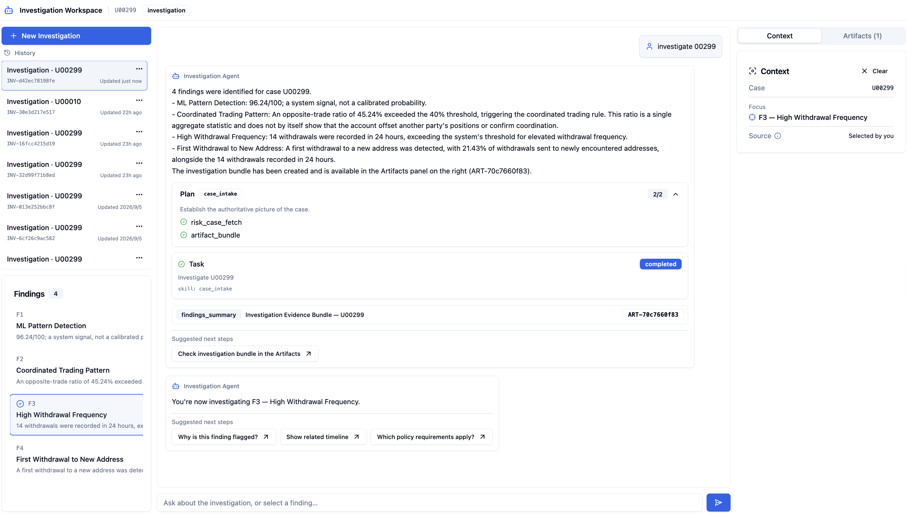
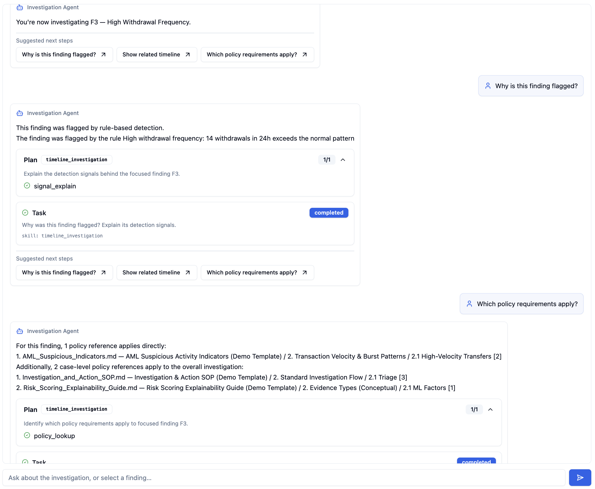
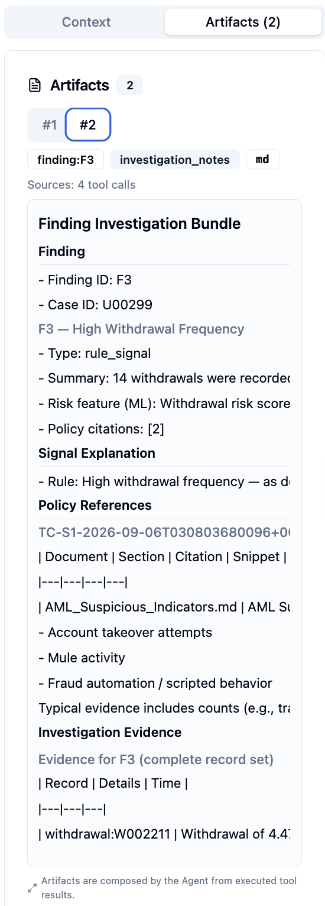
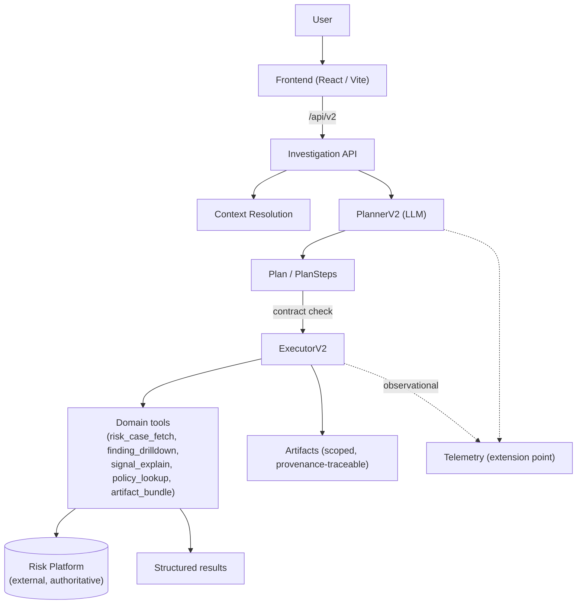

# Investigation Agent Client

A **case-centered investigation agent for risk analysts** — a focused
workspace where an analyst opens a case, investigates its findings through
conversation, and produces provenance-traceable investigation artifacts.
It runs **on top of an existing Risk Platform**, which remains the
authoritative source for risk signals, evidence, policy citations, and
case explanations. The Agent Client adds the investigation layer:
planning, orchestration, context, and scoped outputs.

## See It First

### 1. Investigation Workspace



The three-panel workspace combines investigation navigation (history and
findings), the Agent conversation, and the current case/finding context.

### 2. Agent Investigation Flow



The conversation surface exposes structured execution state — Plan, Task,
skill, structured result, artifact, and suggested next steps — alongside
the natural-language answer. The Agent does not hide execution behind one
opaque conversational response.

### 3. Generated Investigation Artifact



Artifacts are intentionally scope-controlled: **case-level** bundles
summarize the whole case, while **finding-level** bundles contain only
content associated with that finding. Context and Artifacts are separate
tabs in the workspace (shown here as separate panels).

## What the Agent Does

| Capability | Example request |
|---|---|
| Case intake | "Investigate U00299" |
| Focus Mode | select a finding (F1, F2, …) in the Findings panel |
| Timeline investigation | "Show the timeline for this finding." |
| Withdrawal investigation | "Show me all the withdrawals." |
| Transaction investigation | "Show me all the transactions." |
| Signal explanation | "Why is this finding flagged?" |
| Policy retrieval | "Which policy requirements apply?" |
| Artifact generation | "Generate a Markdown investigation bundle." |
| Suggested next steps | follow-up chips attached to each Agent response |

Core invariants:

- **One Investigation = One Case.** A request naming a different case
  gets bounded guidance to start a new investigation — never silent
  re-targeting.
- **Unsupported operations are bounded and explicit.** The system never
  silently substitutes unrelated evidence (e.g. transactions for a
  withdrawals request) or fabricates a plausible answer.

## Why This Is an Agent

A request is mapped to a structured investigation plan, executed against
domain tools, and answered from structured results:

```text
Natural language request
        ↓
      Planner (PlannerV2)
        ↓
   Plan / PlanSteps
        ↓
    Executor (ExecutorV2)
        ↓
     Domain tools
        ↓
Risk Platform (evidence / policy / explanation)
        ↓
   Structured result / artifact
```

The Planner maps the user's natural-language request to an investigation
operation. It does **not** invent authoritative attributes — detector
identity, for example, is derived at runtime from the focused finding's
`signal_refs`, not chosen by the LLM.

| Natural-language request | Planned operation |
|---|---|
| "Why is this finding flagged?" | `explain_signal` |
| "Show me all withdrawals." | `inspect_withdrawals` |
| "Show me all transactions." | `inspect_transactions` |
| "Show me the opposite trade." | `inspect_opposite_trades` |

Intent recognition is distinct from runtime capability: opposite-trade
investigation may be bounded as unsupported for a given finding — but the
Planner still recognizes it as that operation instead of silently
substituting generic evidence.

## Architecture



Telemetry is an **observational side channel** (dashed) — it never
participates in findings, evidence, policy truth, or execution decisions.
See [Telemetry](#telemetry).

## Key Engineering Principles

1. **Composition, not computation** — artifacts and responses are
   deterministic compositions of already-produced tool results; nothing is
   recomputed or invented.
2. **Authoritative source of truth** — the Risk Platform owns findings,
   scores, evidence, policy citations, and explanations; the Agent
   normalizes and presents them.
3. **Capability-gated behavior** — operations are offered and executed
   only when the focused finding's declared capabilities support them.
4. **Case/finding scope separation** — finding-scoped outputs contain only
   that finding's content; case-scoped outputs may legitimately be broader.
5. **Task completion ≠ semantic success** — evaluation asserts semantic
   outcomes, not just status.
6. **Bounded honesty** — empty, unsupported, unresolved, and unavailable
   are distinct, explicitly-worded outcomes; nothing is fabricated.
7. **Traceable structured execution** — every turn records its Plan,
   ToolCalls, results, and artifacts.

Details: [AGENT_RESPONSE_EVIDENCE_PRINCIPLES_V1.md](docs/architecture/AGENT_RESPONSE_EVIDENCE_PRINCIPLES_V1.md) (P1–P20).

## Evaluation

The Agent is evaluated across three **separate** layers (never combined
into one score):

| Evaluation | Purpose | Result |
|---|---|---|
| Runtime Semantic Evaluation | downstream semantic correctness with fixed/scaffolded plans | 15/15 — 100% |
| Planner Evaluation | real-LLM natural-language intent → plan routing | 27/30 — 90.0% |
| Live E2E Evaluation | real LLM + real Risk Platform | 5/5 — 100% |

Planner Evaluation runs 10 natural-language scenarios, 3 real-LLM runs
per scenario (30 total runs); 9/10 scenarios are perfectly stable.

Known Planner limitation — **P09**:

> "Switch to finding F2 and show me its timeline."
> → 0/3 valid plans (`INVALID_LLM_OUTPUT`)

This is a Planner limitation for compound natural-language requests that
combine finding focus switching with a follow-up investigation operation.
The focus/context mechanism itself exists and works.

Full methodology, scenario model, failure taxonomy, and stability
measurement: [AGENT_EVALUATION_V1.md](docs/architecture/AGENT_EVALUATION_V1.md).

## Telemetry

The runtime exposes a thin, **observational** telemetry extension point
(`backend/app/telemetry.py`):

- structured planner events (`planner.started/completed/failed`) and
  execution events (`execution.started/completed/failed`)
- a `semantic.evaluated` event contract for evaluation runs
- pluggable `TelemetrySink` — no-op default, in-memory sink for tests
- telemetry failures are isolated at the telemetry boundary and never
  break investigation execution
- no chain-of-thought, raw prompts, or raw model output is stored

**Persistent production telemetry is not implemented in Week 1.** This is
an extension point for future continuous evaluation and observability.

## Tech Stack

| Layer | Technologies |
|---|---|
| Backend | Python 3.12, FastAPI, Pydantic v2, Uvicorn, httpx |
| Frontend | React 18, TypeScript, Vite, Tailwind CSS, Radix UI, nginx (prod) |
| Agent / Evaluation | PlannerV2 (LLM planning), ExecutorV2, deterministic evaluation framework (`backend/eval/`), pytest |
| Deployment | Docker, Docker Compose, nginx reverse proxy |

## Run

### Local development

Prerequisites: Python 3.12, Node 20, a running **Risk Platform** on
`localhost:8000` (external dependency, separate repository), and LLM
credentials.

```bash
# 1. Backend (port 8001)
cd backend
python -m venv .venv && source .venv/bin/activate
pip install -r requirements.txt
uvicorn app.main:app --host 127.0.0.1 --port 8001

# 2. Frontend (port 3001, proxies /api → localhost:8001)
cd frontend
npm install
npm run dev
```

Configure LLM credentials in `backend/.env` (see
`backend/.env.example`): `ANTHROPIC_API_KEY`, `ANTHROPIC_BASE_URL`,
`ANTHROPIC_MODEL`.

### Docker

```bash
cp .env.example .env        # set RISK_PLATFORM_BASE_URL + credentials
docker compose up --build
```

- Frontend: `http://localhost:3001`
- Backend: `http://localhost:8001` (health: `/health`)

The Compose stack runs the frontend (nginx: static + `/api` reverse proxy)
and the backend. The **Risk Platform is not included** — keep it running
and point `RISK_PLATFORM_BASE_URL` at it
(`http://host.docker.internal:8000` reaches a host-local Risk Platform).

## Evaluation Commands

```bash
cd backend

# Runtime Semantic Evaluation (deterministic, scripted planner, stubbed RP)
python -m eval.run_eval --mode scripted
python -m eval.run_eval --mode live            # real RP + real LLM
python -m eval.run_eval --mode scripted --category evidence
python -m eval.run_eval --mode scripted --scenario E07

# Planner Evaluation (real configured LLM, 3 runs per scenario)
python -m eval.run_planner_eval --runs 3
python -m eval.run_planner_eval --scenario P08

# Unit / regression suites
python -m pytest tests/ -q
```

## Project Structure

```text
├── backend/
│   ├── app/                  # FastAPI runtime: planner, executor,
│   │                         # domain tools, composer, telemetry
│   ├── eval/                 # Agent evaluation framework (scenarios,
│   │                         # checkers, runner, report)
│   ├── tests/                # unit / integration / E2E regression suites
│   ├── requirements.txt
│   ├── Dockerfile
│   └── start.sh
├── frontend/                 # React + Vite workspace (nginx in Docker)
│   ├── src/pages/            # InvestigationPage workspace
│   ├── src/components/       # conversation, findings, artifacts, context
│   ├── Dockerfile
│   └── nginx.conf
├── docs/
│   ├── architecture/         # normative architecture & evaluation docs
│   └── screenshots/          # product screenshots
├── docker-compose.yml
└── .env.example
```

## Documentation

| Document | Content |
|---|---|
| [AGENT_CLIENT_ARCHITECTURE_V2.md](docs/architecture/AGENT_CLIENT_ARCHITECTURE_V2.md) | runtime architecture: resolution → planning → execution → composition |
| [AGENT_EVALUATION_V1.md](docs/architecture/AGENT_EVALUATION_V1.md) | canonical evaluation documentation (layers, scenarios, checkers, metrics) |
| [DOMAIN_MODELS_V1.md](docs/architecture/DOMAIN_MODELS_V1.md) | domain model contract (Finding, capabilities, Plan, ToolResult, …) |
| [SKILL_MODEL_V1.md](docs/architecture/SKILL_MODEL_V1.md) | skill registry, step vocabulary, step→tool bindings |
| [FOLLOW_UP_MODEL_V1.md](docs/architecture/FOLLOW_UP_MODEL_V1.md) | suggested follow-ups contract |
| [API_CONTRACT_V1.md](docs/architecture/API_CONTRACT_V1.md) | HTTP boundary contracts |
| [AGENT_RESPONSE_EVIDENCE_PRINCIPLES_V1.md](docs/architecture/AGENT_RESPONSE_EVIDENCE_PRINCIPLES_V1.md) | P1–P20 engineering principles |

## Week 1 Baseline

Frozen at commit `1626df2` — *"feat: freeze week 1 agent runtime and
evaluation"*.

| Check | Result |
|---|---|
| Backend tests | 757 passed, 1 skipped, 1 xfailed, 0 failed |
| Runtime Semantic Evaluation | 15/15 — 100% |
| Planner Evaluation | 27/30 runs — 90.0%; 9/10 scenarios perfectly stable |
| Live E2E Evaluation | 5/5 — 100% |
| Frontend | TypeScript clean; Vite build passed |

## Known Limitations

- **P09 (known Planner limitation, intentionally retained):** the compound
  request *"Switch to finding F2 and show me its timeline."* produced
  0/3 valid plans (`INVALID_LLM_OUTPUT`) in the Planner Evaluation.
  This is a Planner limitation for compound natural-language requests that
  combine finding focus switching with a follow-up investigation
  operation — the focus/context mechanism itself works, and downstream
  safety was never compromised.
- Opposite-trade investigation is a recognized **intent** whose
  evidence view is not implemented in Week 1: requests are routed to a
  dedicated, bounded unsupported outcome (never generic transaction
  evidence).
- No persistent production telemetry store; the telemetry contract and
  no-op/in-memory sinks are the Week 1 scope.
- The Risk Platform is required and external; the Agent cannot produce
  investigation results without it.
